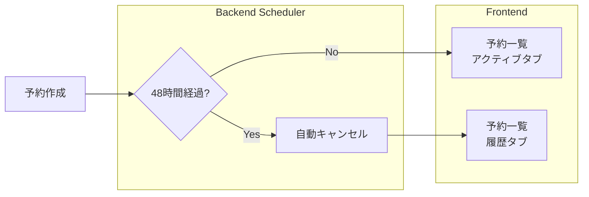

# 支払い待ち予約の自動キャンセルとタブUI

振込待ち・決済待ちの予約を48時間経過後に自動キャンセルし、予約一覧画面を「アクティブ」と「履歴」の2タブに分ける機能を実装します。

## 変更概要



## Proposed Changes

### Backend - Repository

#### [MODIFY] [ReservationRepository.java](file:///c:/Users/user/Dev/FarMeet/farmeet-backend/src/main/java/com/farmeet/repository/ReservationRepository.java)

期限切れの支払い待ち予約を検索するクエリメソッドを追加：

```java
// 支払い期限切れの予約を検索（自動キャンセル用）
@Query("SELECT r FROM Reservation r WHERE r.status IN :statuses AND r.createdAt < :deadline")
List<Reservation> findExpiredPendingPaymentReservations(
    @Param("statuses") List<ReservationStatus> statuses,
    @Param("deadline") LocalDateTime deadline);

// アクティブな予約を取得（CONFIRMED, PENDING_PAYMENT, AWAITING_TRANSFER）
@Query("SELECT r FROM Reservation r WHERE r.user.id = :userId AND r.status IN :statuses ORDER BY r.createdAt DESC")
List<Reservation> findActiveByUserId(
    @Param("userId") Long userId,
    @Param("statuses") List<ReservationStatus> statuses);

// 履歴の予約を取得（CANCELLED, COMPLETED, PAYMENT_FAILED）
@Query("SELECT r FROM Reservation r WHERE r.user.id = :userId AND r.status IN :statuses ORDER BY r.createdAt DESC")
List<Reservation> findHistoryByUserId(
    @Param("userId") Long userId,
    @Param("statuses") List<ReservationStatus> statuses);
```

---

### Backend - Scheduler

#### [MODIFY] [ReservationScheduler.java](file:///c:/Users/user/Dev/FarMeet/farmeet-backend/src/main/java/com/farmeet/scheduler/ReservationScheduler.java)

48時間経過した支払い待ち予約を自動キャンセルするスケジュールタスクを追加：

```java
/**
 * 1時間ごとに実行
 * 48時間経過した支払い待ち予約を自動キャンセル
 */
@Scheduled(fixedRate = 3600000) // 1時間ごと
@Transactional
public void cancelExpiredPendingPayments() {
    LocalDateTime deadline = LocalDateTime.now().minusHours(48);
    
    List<ReservationStatus> pendingStatuses = List.of(
        ReservationStatus.PENDING_PAYMENT,
        ReservationStatus.AWAITING_TRANSFER
    );
    
    List<Reservation> expiredReservations = reservationRepository
        .findExpiredPendingPaymentReservations(pendingStatuses, deadline);
    
    int count = 0;
    for (Reservation reservation : expiredReservations) {
        // スロットを戻す
        ExperienceEvent event = reservation.getEvent();
        event.setAvailableSlots(event.getAvailableSlots() + reservation.getNumberOfPeople());
        eventRepository.save(event);
        
        // ステータスをキャンセルに変更
        reservation.setStatus(ReservationStatus.CANCELLED);
        reservationRepository.save(reservation);
        count++;
    }
    
    if (count > 0) {
        logger.info("Auto-cancelled {} expired pending payment reservations", count);
    }
}
```

---

### Backend - Service

#### [MODIFY] [ReservationService.java](file:///c:/Users/user/Dev/FarMeet/farmeet-backend/src/main/java/com/farmeet/service/ReservationService.java)

アクティブ予約と履歴予約を分けて取得するメソッドを追加：

```java
private static final List<ReservationStatus> ACTIVE_STATUSES = List.of(
    ReservationStatus.CONFIRMED,
    ReservationStatus.PENDING_PAYMENT,
    ReservationStatus.AWAITING_TRANSFER
);

private static final List<ReservationStatus> HISTORY_STATUSES = List.of(
    ReservationStatus.CANCELLED,
    ReservationStatus.COMPLETED,
    ReservationStatus.PAYMENT_FAILED
);

public List<Reservation> getActiveReservations(Long userId) {
    return reservationRepository.findActiveByUserId(userId, ACTIVE_STATUSES);
}

public List<Reservation> getHistoryReservations(Long userId) {
    return reservationRepository.findHistoryByUserId(userId, HISTORY_STATUSES);
}
```

---

### Backend - Controller

#### [MODIFY] [ReservationController.java](file:///c:/Users/user/Dev/FarMeet/farmeet-backend/src/main/java/com/farmeet/controller/ReservationController.java)

アクティブ予約と履歴予約を返すエンドポイントを追加：

```java
@GetMapping("/active")
public ResponseEntity<List<ReservationDto>> getActiveReservations() {
    User user = authService.getCurrentUser();
    List<Reservation> reservations = reservationService.getActiveReservations(user.getId());
    return ResponseEntity.ok(reservations.stream()
        .map(ReservationDto::fromEntity)
        .toList());
}

@GetMapping("/history")
public ResponseEntity<List<ReservationDto>> getHistoryReservations() {
    User user = authService.getCurrentUser();
    List<Reservation> reservations = reservationService.getHistoryReservations(user.getId());
    return ResponseEntity.ok(reservations.stream()
        .map(ReservationDto::fromEntity)
        .toList());
}
```

---

### Frontend - API

#### [MODIFY] [api.ts](file:///c:/Users/user/Dev/FarMeet/farmeet-frontend/lib/api.ts)

新規エンドポイントを追加：

```typescript
getActiveReservations: () => fetchWithAuth('/reservations/active'),
getHistoryReservations: () => fetchWithAuth('/reservations/history'),
```

---

### Frontend - UI

#### [MODIFY] [page.tsx](file:///c:/Users/user/Dev/FarMeet/farmeet-frontend/app/reservations/page.tsx)

タブUIと残り時間表示を追加：

```tsx
// 主な変更点:
// 1. タブ切り替えUI（アクティブ/履歴）
// 2. アクティブタブ: CONFIRMED, PENDING_PAYMENT, AWAITING_TRANSFER
// 3. 履歴タブ: CANCELLED, COMPLETED, PAYMENT_FAILED
// 4. 支払い待ち予約に「残り○時間」の表示を追加
```

タブのUIイメージ:
```
[ アクティブ ] [ 履歴 ]
```

残り時間表示のロジック:
```typescript
const getRemainingTime = (createdAt: string): string | null => {
    const deadline = new Date(createdAt);
    deadline.setHours(deadline.getHours() + 48);
    const now = new Date();
    const diff = deadline.getTime() - now.getTime();
    
    if (diff <= 0) return null;
    
    const hours = Math.floor(diff / (1000 * 60 * 60));
    const minutes = Math.floor((diff % (1000 * 60 * 60)) / (1000 * 60));
    
    if (hours > 0) {
        return `残り${hours}時間`;
    }
    return `残り${minutes}分`;
};
```

---

## Verification Plan

### 手動テスト

1. **タブUI確認**
   - ブラウザで `/reservations` を開く
   - 「アクティブ」と「履歴」タブが表示されることを確認
   - タブ切り替えで該当する予約のみ表示されることを確認

2. **残り時間表示確認**
   - 支払い待ち（`PENDING_PAYMENT` or `AWAITING_TRANSFER`）の予約がある場合、残り時間が表示されることを確認
   - 確定済み（`CONFIRMED`）の予約には残り時間が表示されないことを確認

3. **自動キャンセル確認**（オプション - 長期テスト）
   - バックエンドのログで `Auto-cancelled X expired pending payment reservations` メッセージを確認
   - テスト環境で期限を短く（例：1分）に変更して動作確認することも可能

### サーバーログ確認

バックエンドのコンソールで以下のログが表示されることを確認:
```
INFO  c.f.scheduler.ReservationScheduler - Auto-cancelled X expired pending payment reservations
```
