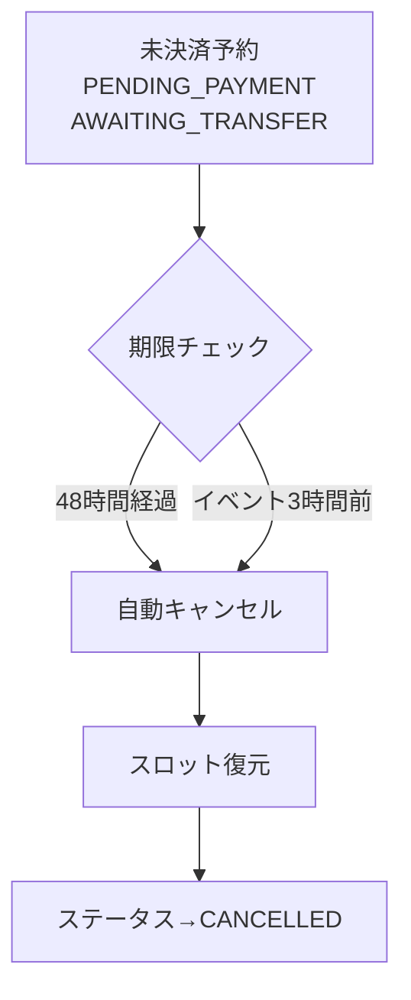

# 支払い待ち予約の自動キャンセルとタブUI - Walkthrough

## 実装概要

振込待ち・決済待ちの予約を自動キャンセルし、予約一覧を「アクティブ」「履歴」の2タブに分ける機能を実装しました。

## 変更ファイル

### バックエンド

| ファイル | 変更内容 |
|---------|---------|
| [ReservationRepository.java](file:///c:/Users/user/Dev/FarMeet/farmeet-backend/src/main/java/com/farmeet/repository/ReservationRepository.java) | 期限切れ予約検索、アクティブ/履歴予約取得クエリを追加 |
| [ReservationScheduler.java](file:///c:/Users/user/Dev/FarMeet/farmeet-backend/src/main/java/com/farmeet/scheduler/ReservationScheduler.java) | 48時間経過 or イベント3時間前の自動キャンセル処理を追加 |
| [ReservationService.java](file:///c:/Users/user/Dev/FarMeet/farmeet-backend/src/main/java/com/farmeet/service/ReservationService.java) | `getActiveReservations()`, `getHistoryReservations()` メソッドを追加 |
| [ReservationController.java](file:///c:/Users/user/Dev/FarMeet/farmeet-backend/src/main/java/com/farmeet/controller/ReservationController.java) | `/api/reservations/active`, `/api/reservations/history` エンドポイントを追加 |

### フロントエンド

| ファイル | 変更内容 |
|---------|---------|
| [api.ts](file:///c:/Users/user/Dev/FarMeet/farmeet-frontend/lib/api.ts) | `getActiveReservations()`, `getHistoryReservations()` を追加 |
| [page.tsx](file:///c:/Users/user/Dev/FarMeet/farmeet-frontend/app/reservations/page.tsx) | タブUI（アクティブ/履歴）と残り時間表示を実装 |

## 自動キャンセルロジック

以下の**いずれか早い方**で未決済予約を自動キャンセル：

1. **予約作成から48時間経過**
2. **イベント開始3時間前**



## 予約一覧のタブ分類

| タブ | ステータス |
|------|-----------|
| **アクティブ** | CONFIRMED, PENDING_PAYMENT, AWAITING_TRANSFER |
| **履歴** | CANCELLED, COMPLETED, PAYMENT_FAILED |

## 残り時間表示

支払い待ちの予約には「残り○時間」または「残り○分」が表示されます。期限が近づくとオレンジ色で警告表示されます。

## 検証方法

1. http://localhost:3000/reservations にアクセス
2. 「アクティブ」「履歴」タブが表示されることを確認
3. 支払い待ちの予約がある場合、残り時間が表示されることを確認
4. 自動キャンセルはバックエンドログで確認：
   ```
   INFO c.f.scheduler.ReservationScheduler - Auto-cancelled X expired pending payment reservations
   ```
