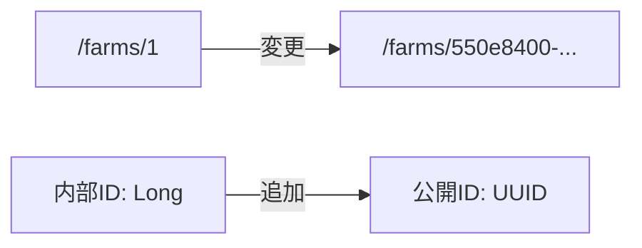

# Farm URL UUID化

農園の公開URLを連番ID（`/farms/1`）からUUID（`/farms/550e8400-...`）に変更します。

## 変更概要



> [!IMPORTANT]
> 既存の農園データには自動でUUIDが生成されます。

---

## Proposed Changes

### Backend - Entity

#### [MODIFY] [Farm.java](file:///c:/Users/user/Dev/FarMeet/farmeet-backend/src/main/java/com/farmeet/entity/Farm.java)

`publicId`フィールド（UUID）を追加：

```java
import java.util.UUID;

@Column(name = "public_id", unique = true, nullable = false, updatable = false)
private UUID publicId;

@PrePersist
protected void onCreate() {
    createdAt = LocalDateTime.now();
    if (publicId == null) {
        publicId = UUID.randomUUID();
    }
}
```

---

### Backend - Repository

#### [MODIFY] [FarmRepository.java](file:///c:/Users/user/Dev/FarMeet/farmeet-backend/src/main/java/com/farmeet/repository/FarmRepository.java)

UUID検索メソッドを追加：

```java
import java.util.Optional;
import java.util.UUID;

Optional<Farm> findByPublicId(UUID publicId);
```

---

### Backend - Service

#### [MODIFY] [FarmService.java](file:///c:/Users/user/Dev/FarMeet/farmeet-backend/src/main/java/com/farmeet/service/FarmService.java)

UUID検索メソッドを追加：

```java
public FarmDto getFarmDtoByPublicId(UUID publicId) {
    Farm farm = farmRepository.findByPublicId(publicId)
        .orElseThrow(() -> new RuntimeException("Farm not found"));
    return FarmDto.fromEntity(farm);
}
```

---

### Backend - Controller

#### [MODIFY] [FarmController.java](file:///c:/Users/user/Dev/FarMeet/farmeet-backend/src/main/java/com/farmeet/controller/FarmController.java)

UUID用エンドポイントを追加：

```java
@GetMapping("/p/{publicId}")
public ResponseEntity<FarmDto> getFarmByPublicId(@PathVariable UUID publicId) {
    try {
        return ResponseEntity.ok(farmService.getFarmDtoByPublicId(publicId));
    } catch (RuntimeException e) {
        return ResponseEntity.notFound().build();
    }
}
```

---

### Backend - DTO

#### [MODIFY] [FarmDto.java](file:///c:/Users/user/Dev/FarMeet/farmeet-backend/src/main/java/com/farmeet/dto/FarmDto.java)

`publicId`フィールドを追加してレスポンスに含める。

---

### Frontend

#### [MODIFY] [api.ts](file:///c:/Users/user/Dev/FarMeet/farmeet-frontend/lib/api.ts)

UUID用API呼び出しを追加：

```typescript
async getFarmByPublicId(publicId: string) {
    const response = await fetch(`${API_BASE_URL}/farms/p/${publicId}`);
    if (!response.ok) throw new Error('Failed to get farm');
    return response.json();
}
```

#### [MODIFY] [page.tsx](file:///c:/Users/user/Dev/FarMeet/farmeet-frontend/app/farms/%5Bid%5D/page.tsx)

URLパラメータをUUIDとして処理するように変更。

#### [MODIFY] 各所のリンク

農園へのリンクを`publicId`ベースに変更。

---

## Verification Plan

1. バックエンドを再起動して新規農園を作成 → UUIDが自動生成されることを確認
2. `/farms/p/{publicId}` でアクセスできることを確認
3. フロントエンドで農園詳細ページが表示されることを確認
