# ギフト券バックエンド実装計画

ユーザーがギフト券を購入・登録・利用できるようにするためのバックエンド実装計画。

## お金のフロー概要

```mermaid
flowchart TD
    subgraph 購入フロー
        A[購入者] -->|1. 購入リクエスト| B[GiftVoucherController]
        B -->|2. 決済作成| C[StripeService/PayPayService]
        C -->|3. 決済完了| D[GiftVoucher作成 - PENDING]
        D -->|4. activate| E[GiftVoucher - ACTIVE + コード発行]
    end

    subgraph 登録フロー
        F[受取人] -->|1. コード入力| G[checkGiftVoucher]
        G -->|2. 登録| H[redeemGiftVoucher]
        H -->|3. ユーザーに紐付け| I[GiftVoucher.owner = 受取人]
    end

    subgraph 利用フロー
        J[予約時] -->|1. ギフト券を選択| K[PaymentService]
        K -->|2. 残高から差し引き| L[GiftVoucher.balance -= 使用額]
        K -->|3. 残額を決済| M[Stripe/PayPay/銀行振込]
    end
```



---

## 提案する変更

### Entity / DTO

#### [NEW] [GiftVoucherStatus.java](file:///c:/Users/user/Dev/FarMeet/farmeet-backend/src/main/java/com/farmeet/entity/GiftVoucherStatus.java)
ギフト券のステータス列挙型:
- `PENDING` - 購入手続き中（決済待ち）
- `ACTIVE` - 有効（使用可能、未登録）
- `REDEEMED` - 登録済み（ユーザーに紐付け済み）
- `USED` - 使用済み（残高0）
- `EXPIRED` - 有効期限切れ
- `CANCELLED` - キャンセル済み

#### [NEW] [GiftVoucher.java](file:///c:/Users/user/Dev/FarMeet/farmeet-backend/src/main/java/com/farmeet/entity/GiftVoucher.java)
ギフト券エンティティ:
| フィールド | 型 | 説明 |
|-----------|---|------|
| id | Long | 主キー |
| code | String | ユニークなギフト券コード（16文字） |
| amount | BigDecimal | 額面金額 |
| balance | BigDecimal | 残高 |
| status | GiftVoucherStatus | ステータス |
| purchaser | User | 購入者 |
| owner | User | 現在の所有者（登録後） |
| recipientName | String | 贈り先の名前 |
| recipientEmail | String | 贈り先のメール |
| message | String | 添えるメッセージ |
| paymentMethod | PaymentMethod | 購入時の決済方法 |
| stripePaymentIntentId | String | Stripe決済ID |
| paypayPaymentId | String | PayPay決済ID |
| expiresAt | LocalDateTime | 有効期限（購入から1年） |
| createdAt | LocalDateTime | 作成日時 |
| activatedAt | LocalDateTime | 有効化日時 |
| redeemedAt | LocalDateTime | 登録日時 |

#### [NEW] [GiftVoucherDto.java](file:///c:/Users/user/Dev/FarMeet/farmeet-backend/src/main/java/com/farmeet/dto/GiftVoucherDto.java)
API用のDTOクラス。

---

### Repository

#### [NEW] [GiftVoucherRepository.java](file:///c:/Users/user/Dev/FarMeet/farmeet-backend/src/main/java/com/farmeet/repository/GiftVoucherRepository.java)
- `findByCode(String code)` - コードで検索
- `findByOwnerAndStatus(User owner, GiftVoucherStatus status)` - 所有者のギフト券一覧
- `findByOwnerAndBalanceGreaterThan(User owner, BigDecimal zero)` - 使用可能なギフト券

---

### Service

#### [NEW] [GiftVoucherService.java](file:///c:/Users/user/Dev/FarMeet/farmeet-backend/src/main/java/com/farmeet/service/GiftVoucherService.java)
主要メソッド:
- `purchaseGiftVoucher(...)` - 購入処理開始
- `activateGiftVoucher(Long voucherId)` - 決済完了後の有効化
- `checkGiftVoucher(String code)` - コード確認
- `redeemGiftVoucher(String code, User user)` - ユーザーに登録
- `getMyVouchers(User user)` - 登録済みギフト券一覧
- `getUsableVouchers(User user)` - 使用可能なギフト券一覧
- `useVoucher(Long voucherId, BigDecimal amount)` - 予約時にギフト券を使用

---

### Controller

#### [NEW] [GiftVoucherController.java](file:///c:/Users/user/Dev/FarMeet/farmeet-backend/src/main/java/com/farmeet/controller/GiftVoucherController.java)
APIエンドポイント:
| メソッド | パス | 説明 |
|---------|-----|------|
| POST | `/api/gift-vouchers/purchase` | 購入開始 |
| POST | `/api/gift-vouchers/activate/{voucherId}` | 有効化 |
| GET | `/api/gift-vouchers/check/{code}` | コード確認 |
| POST | `/api/gift-vouchers/redeem/{code}` | 登録 |
| GET | `/api/gift-vouchers/my` | 自分のギフト券一覧 |
| GET | `/api/gift-vouchers/usable` | 使用可能なギフト券一覧 |

---

## 検証計画

### ビルド確認
バックエンドのビルドが通ることを確認:
```bash
cd farmeet-backend
mvn clean compile
```

### 手動API確認
アプリケーション起動後、curlまたはブラウザのフロントエンドからAPIを呼び出して確認:
1. ギフト券購入→決済URL取得
2. 決済完了後の有効化
3. コード確認
4. ユーザー登録
5. 一覧取得

> [!NOTE]
> 既存のユニットテストがないため、ビルド確認と手動APIテストで検証します。
